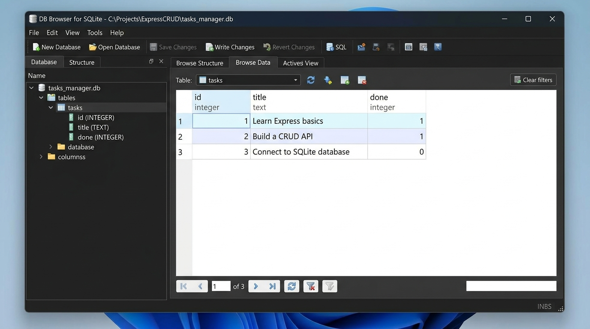

# Flyrank-3: Task CRUD API with SQLite Persistence

A RESTful CRUD API for managing tasks, built with **Node.js**, **Express**, and **SQLite** via `better-sqlite3`. Includes interactive API documentation via **Swagger UI**.

This project represents **Week 3 (Assignment A2)** of the FlyRank Backend Internship: migrating an in-memory CRUD API to a persistent database on disk while preserving 100% of the API contract.

---

## Why SQLite?

In Assignment 1, tasks were stored in-memory in a JavaScript array. While simple for prototyping, every server restart resulted in complete data loss. 

For Assignment 2, **SQLite** was chosen as the persistence layer for key architectural reasons:
1. **Zero Configuration & Serverless**: SQLite requires no external database server, no background daemon, no network credentials, and no connection pooling overhead.
2. **Single-File Database**: The entire database lives in a single local file (`tasks.db`), making backups, inspectability, and local development effortless.
3. **True Persistence & ACID Compliance**: Every create, update, and delete operation is committed to disk, surviving server restarts and crashes.
4. **Clean Synchronous Performance with `better-sqlite3`**: In the Node.js ecosystem, `better-sqlite3` provides fast, synchronous queries without nested async/await boilerplate, keeping business logic readable from top to bottom.

---

## Database Location & Automatic Creation

- **Database File**: `tasks.db`
- **Location**: Project root directory (`./tasks.db`).
- **Automatic Lifecycle**: 
  - When the application starts, it checks if `tasks.db` exists. If not, SQLite creates it automatically.
  - The `tasks` table is created automatically if it does not exist (`CREATE TABLE IF NOT EXISTS`).
  - If the `tasks` table is empty (`COUNT = 0`), the database automatically seeds **3 default example tasks** inside a safe transaction. Subsequent restarts detect existing rows and do not duplicate seeds.
  - `tasks.db` is intentionally included in `.gitignore` so that anyone cloning the repository gets a clean, fresh database created automatically upon their first run.

---

## Quickstart: One Command to Run

Clone the repository and run:

```bash
npm install && node app.js
```

The server starts at `http://localhost:3000`.
- **API Info**: `http://localhost:3000/`
- **Health Check**: `http://localhost:3000/health`
- **Interactive Swagger UI Docs**: `http://localhost:3000/docs`

---

## API Endpoints

All endpoints maintain identical request and response shapes as Assignment 1:

| Method | Path | Description | Success Code | Error Code |
|--------|------|-------------|--------------|------------|
| `GET` | `/` | Welcome info & Swagger documentation link | `200 OK` | — |
| `GET` | `/health` | Server health check | `200 OK` | — |
| `GET` | `/tasks` | List all tasks from SQLite | `200 OK` | — |
| `GET` | `/tasks/:id` | Get single task by ID (parameterized) | `200 OK` | `404 Not Found` |
| `POST` | `/tasks` | Create task (`{ "title": "..." }`) | `201 Created` | `400 Bad Request` |
| `PUT` | `/tasks/:id` | Update title and/or done status | `200 OK` | `400 Bad Request`, `404 Not Found` |
| `DELETE` | `/tasks/:id` | Delete task by ID | `204 No Content` | `404 Not Found` |

### Example Request & Response

```bash
curl -i http://localhost:3000/tasks/1
```

```http
HTTP/1.1 200 OK
Content-Type: application/json; charset=utf-8

{"id":1,"title":"Learn Express basics","done":true}
```

---

## Database Schema & Inspection

### Table Structure: `tasks`

```sql
CREATE TABLE IF NOT EXISTS tasks (
  id INTEGER PRIMARY KEY AUTOINCREMENT,
  title TEXT NOT NULL,
  done INTEGER NOT NULL DEFAULT 0
);
```

### Visual Inspection with DB Browser for SQLite

You can open `tasks.db` directly in [DB Browser for SQLite](https://sqlitebrowser.org/) to inspect tables, view rows, and execute raw SQL queries alongside the running API.



### Stage 4 SQL Exploration Example

During Stage 4, raw SQL queries were executed against `tasks.db`:

```sql
-- Query executed:
SELECT * FROM tasks WHERE done = 1;
```

**What it returned:**
```
┌─────────┬────┬────────────────────────┬──────┐
│ (index) │ id │ title                  │ done │
├─────────┼────┼────────────────────────┼──────┤
│ 0       │ 1  │ 'Learn Express basics' │ 1    │
│ 1       │ 2  │ 'Build a CRUD API'     │ 1    │
└─────────┴────┴────────────────────────┴──────┘
```
**Explanation**: This query filters the database records directly using the SQL engine (`WHERE done = 1`) and returned only completed tasks without requiring any code-level looping or filtering in JavaScript.

To run the exploration script locally:
```bash
node scripts/explore.js
```

---

## Verification & Persistence Proof

1. **Automatic Initialization**: Delete `tasks.db` and start the server. The file is created and seeded with 3 tasks.
2. **Persistence Test**:
   - Send `POST /tasks` with `{ "title": "Test persistence" }` (returns ID 4).
   - Stop the server process (`Ctrl+C`).
   - Start the server again (`node app.js`).
   - Send `GET /tasks` — Task 4 remains present on disk.
